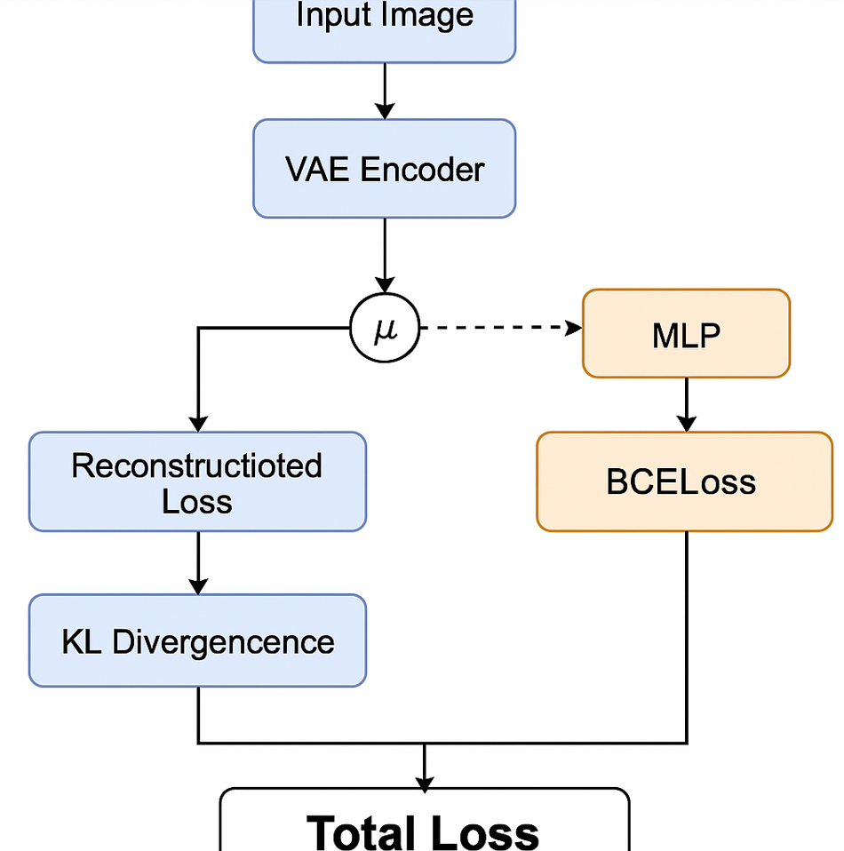

# VAE+MLP 联合训练

1. 将图像输入 VAE，得到 `recon`, `mu`, `logvar`
2. 从 `mu` 得到 MLP 的预测概率
3. 分别计算：
   - VAE 重建损失
   - KL 散度
   - MLP 分类损失（BCELoss）
4. 三项合并为 `total loss`
5. 反向传播 → 更新 VAE + MLP 参数

```
VAE 编码器 → mu → 
                ├─→ 重建图像（decoder）→ recon_loss + KL
                └─→ MLP → 分类预测 → BCELoss

整合： recon_loss + KL + MLP_loss → backward() → 更新整个网络
```



------

### loss_function() 损失合并

```python
if retrain_indicator == 1:
    loss_fn = nn.BCELoss(reduction="mean")
```

- 如果 `retrain_indicator==1`，就说明要加上 MLP 的分类损失。
- 损失函数使用 `BCELoss`（二分类交叉熵），适合 Sigmoid 输出。

------

```python
    mu_mlp = torch.squeeze(torch.squeeze(mu, dim=2), dim=2)
```

- 原始的 `mu` 是形状 `[B, latent_size*base, 1, 1]`
- 去掉 2 个单元素维度后变成 `[B, latent_size*base]`，这就是 MLP 的输入。

------

```python
    y = mlp_model(mu_mlp)
```

- 把 `mu` 传给 MLP 模型，得到输出 `y`，形状为 `[B, 1]`，是属于类别 1 的概率。

------

```python
    y = torch.squeeze(y, dim=1)
```

- 把 `[B, 1]` squeeze 成 `[B]`，方便与标签计算 loss。

------

```python
    mlp_loss = loss_fn(y, labels)
```

- 计算 MLP 的分类损失，对比预测概率 `y` 和真实标签 `labels`（都是 float 类型）

------

```python
    beta_vae_loss = beta_vae_loss + mlp_loss
```

- 把 MLP 的损失加到 VAE 的总损失里。
- `beta_vae_loss` 原来只包括重建 + KL，这里融合 MLP 部分形成联合优化目标。

------

```python
if retrain_indicator == 0:
    mlp_loss = 0
```

- 如果不训练 MLP，就不计算 `mlp_loss`。

------

### train() 函数内调用

我们再看训练逻辑是怎么调用 `loss_function()` 的：

```python
for batch_idx, dataset in enumerate(train_loader):
    data, labels  = dataset
```

- 加载一个 batch 的图像和标签（恶性 or 良性）

------

```python
    data = data.float().to(device)
    labels = labels.float().to(device)
```

- 送到 GPU，并转成 float（用于计算）

------

```python
    optimiser.zero_grad()
```

- 清除上一轮的梯度

------

```python
    recon_batch, mu, logvar = vae_model(data)
```

- 前向传播：拿到 VAE 的输出：
  - `recon_batch`: 重建图像
  - `mu`, `logvar`: 编码器的均值和方差张量

------

```python
    loss, recon_loss, kld, ssim_score, pure_loss, mlp_loss = loss_function(recon_batch, data, mu, logvar, epoch, hyperparams, retrain_indicator, labels)
```

- 调用你刚才看到的联合损失函数，返回综合损失和各项指标

------

```python
    loss.backward()
```

- 反向传播：计算 VAE 和 MLP 的梯度（因为损失中已经合并）

------

```python
    optimiser.step()
```

- 更新两个模型（VAE 和 MLP）的参数（因为它们都参与了 `loss`）

------

### train_VAE_model() 训练入口

```python
train_loss, ssim_score, kld = train(..., retrain_indicator=1)
```

- 在 `train_VAE_model()` 中调用 `train()`，此时设置 `retrain_indicator=1`，说明开启联合训练

### 权重设置

| 参数名              | 控制的部分             | 控制什么         |
| ------------------- | ---------------------- | ---------------- |
| `recon_loss_weight` | 整个重建损失部分的权重 | 占总 loss 比例   |
| `beta`              | KL 散度的强度          | 表达能力 vs 正则 |
| `mlp_loss_weight`   | MLP 分类损失的强度     | 分类能力优先     |

- 更重视重建质量，降低分类影响 → 用小 `mlp_loss_weight`，比如 `0.2`
- 更重视分类准确率 → 用大 `mlp_loss_weight`，比如 `2.0`
- 模型重建图像太差 → 增大 `recon_loss_weight`（例如 2.0）


# 其它

这份脚本 `VAE_joint_loss_mal_benign.py` 的 **核心逻辑** 是通过 **一个集成损失函数 `loss_function()`** 来联合训练 **VAE 和 MLP**，实现重建 + 分类的端到端优化。

------

## ✅ 1. 联合训练的位置

**函数 `train_VAE_model()` 中调用了 `train()` 和 `test()`：**

- `train()` 是 VAE + MLP 的联合训练（如果 `retrain_indicator == 1`）
- `test()` 也进行联合评估
- 关键调用：

```python
loss = loss_function(recon_batch, data, mu, logvar, epoch, hyperparams, retrain_indicator, labels)
```

------

## ✅ 2. 联合损失函数结构

在 `loss_function()` 中：

```python
if retrain_indicator == 1:
    # 如果需要联合训练，就引入分类损失
    y = mlp_model(mu_mlp)
    mlp_loss = BCELoss(y, labels)
    beta_vae_loss += mlp_loss
```

最终输出的 `beta_vae_loss` 包含：

- VAE 重建损失（L1）
- SSIM 或 MS-SSIM
- KL 散度（带 `beta` 权重 + annealing）
- MLP 的 BCE loss（可选）

------

## ✅ 3. 前向流程逻辑梳理

1. **VAE 编码器输出：**

```python
mu, logvar = vae.encode(x)
z = reparameterize(mu, logvar)
```

1. **MLP 使用 `mu.squeeze()`：**

```python
mu_mlp = mu.squeeze(-1).squeeze(-1)  # shape: [B, latent_dim]
y_pred = mlp_model(mu_mlp)          # output: [B, 1]
```

1. **联合损失组成：**

```python
beta_vae_loss = recon_mix + beta_norm * kld * annealing_weight + mlp_loss
```

------

## ✅ 4. 特点总结

| 项目     | 特征                                                         |
| -------- | ------------------------------------------------------------ |
| 重建损失 | 支持 L1 + SSIM / MS-SSIM 混合（带 alpha 权重）               |
| KL 散度  | 支持 `beta` 超参和 annealing                                 |
| 分类损失 | 通过 `retrain_indicator` 控制是否加入 MLP BCE loss           |
| 联合优化 | optimizer 仅在 `train()` 中更新 VAE 参数，MLP 参数默认全局（外部定义） |
| 可视化   | 自动绘图：原图 / 重建图 / 随机生成图                         |

------

## ✅ 5. 实现细节亮点

- **`retrain_indicator == 0`**：只训练 VAE
- **`retrain_indicator == 1`**：联合训练 VAE + MLP（需全局定义 `mlp_model`）
- **early stopping** 用的是 train/test loss gap
- VAE loss 除了常见的 KL 和 recon，还支持多种视觉指标（SSIM、MS-SSIM）

------

## ✅ 总结一句话

这个脚本通过 `loss_function()` 联合多个损失项（L1、SSIM、KL、BCE），并通过 `retrain_indicator` 控制是否联训 MLP，是一个高度集成、兼容超参搜索和重建评估的联合训练实现。

------

是否需要我帮你简化或移植这套联合损失逻辑到你自己的 `JointTrainer` 中？或者根据你自己的训练器风格帮你改写一个更轻量的版本？