# Preprocessing

### LIDC DICOM to Numpy

1. **Run `LIDC_DICOM_to_Numpy.ipynb`**

   - This file will convert DICOM data to `.npy` format data files.
   - To use the latest `pylidc` library: `pip install git+https://github.com/pylidc/pylidc.git`

2. **Create Configuration File**

   - Modify the dataset path.

     ```py
     # prepare_dataset.py configuration
     config['dicom'] = {
         # path to DICOM data
         'Path': r"D:\aMaster\thesis_dataset\LUNG\LIDC-IDRI",
         'Warn': True
     }
     ```

   - Generate the `pylidc.conf` configuration file, including the DICOM data path and warning settings.

     ```py
     # Create the configuration file and put it in the home drive
     with open(r"C:\Users\10735\pylidc.conf", 'w') as f:
         config.write(f)
     ```

   - Modify mask, images, and meta paths.

     ```py
     # prepare_dataset.py configuration
     config['prepare_dataset'] = {
         'LIDC_DICOM_PATH': r"D:\aMaster\thesis_dataset\LUNG\LIDC-IDRI",
         'MASK_PATH': r"D:\aMaster\github_code\VAE_lung_lesion_BMVC\Data\Mask",
         'IMAGE_PATH': r"D:\aMaster\github_code\VAE_lung_lesion_BMVC\Data\Images",
         'META_PATH': r"D:\aMaster\github_code\VAE_lung_lesion_BMVC\Data\Meta",
         'Mask_Threshold': 8
     }
     ```

     - MASK_PATH: Stores `Mask` data, which are binarized mask images extracted from DICOM files.

     - IMAGE_PATH: Stores slice image data extracted from DICOM files in `.npy` format, named sequentially by patient and slice.

     - META_PATH: Stores metadata information in the CSV file `meta_info.csv`, containing relevant information for each slice.

       | patient_id (Patient ID) |                             |                                   |
       | ----------------------- | --------------------------- | --------------------------------- |
       | nodule_no (Nodule No.)  | original_image (Image File) | malignancy (Malignancy Score)     |
       | slice_no (Slice No.)    | mask_image (Mask File)      | is_cancer (Is Cancer, True/False) |

   - Generate the `lung.conf` configuration file, including dataset paths, mask paths, image paths, and other information.

3. **Read the `lung.conf` Configuration File**

   - Extract path information:

     - `DICOM_DIR`: Path for DICOM files to read CT data.
     - `MASK_DIR`: Path to save mask files.
     - `IMAGE_DIR`: Path to save `.npy` slice image data.
     - `META_DIR`: Path to save the `meta_info.csv` file.

   - Extract parameter information:

     - `mask_threshold`: Mask threshold for filtering small masks.
     - `confidence_level`: Confidence level for annotation consistency, default is 0.5.
     - `padding`: Image size, default is 512.

   - Add `is_dir_path` function:

     ```py
     def is_dir_path(path):
         abs_path = os.path.abspath(path)
         if not os.path.exists(abs_path):
             raise FileNotFoundError(f"Path not found: {abs_path}")
         return abs_path
     ```

4. **`MakeDataSet` Class**

   - Initialize the dataset generation class `MakeDataSet`, responsible for extracting lung nodule images from DICOM files and generating `.npy` files.

   - `calculate_malignancy` Method:

     - Calculate malignancy scores based on doctor annotations:

       Score `1-2`: Benign (False); Score `4-5`: Malignant (True); Score `3`: Ambiguous ('Ambiguous').

   - `prepare_dataset` Method:

     - Iterate through each DICOM file, generating image slices and masks.
     - Save `.npy` files and generate some files to record information for each slice.
       - `meta_info.csv`: Provides metadata information for each slice, facilitating classification, filtering, or data localization for model training.
       - `bbox.npy`: Bounding box coordinates for each slice, useful for visualization and cropping.
       - `image-size.npy`: Saves slice size to ensure data consistency.
       - `minmaxX.npy` and `minmaxY.npy`: Further analyze the location of nodules within each slice.

   - Modify Bugs:

     - Invalid save paths:

       ```py
       print("Saved Meta data")
       self.meta.to_csv(os.path.join(self.meta_path, 'meta_info.csv'), index=False)
       ```

     - `DataFrame` object does not have an `append()` method:

       ```py
       def save_meta(self, meta_list):
           tmp = pd.Series(meta_list, index=['patient_id','nodule_no','slice_no','original_image','mask_image','malignancy','is_cancer','is_clean'])
           self.meta = pd.concat([self.meta, tmp.to_frame().T], ignore_index=True)
       ```

     - Ignore `Scan.cluster_annotations()` method error in `pylidc` library.

       ```py
           try:
               scan = pl.query(pl.Scan).filter(pl.Scan.patient_id == pid).first()
           except Exception as e:
               if "ClusterError" in str(e):
                   print(f"ClusterError encountered for Patient ID: {pid}. Skipping...")
                   with open('skipped_patients.txt', 'a') as log_file:
                       log_file.write(f"{pid}\n")
               else:
                   print(f"Unexpected error for Patient ID: {pid}: {str(e)}")
       ```

     - Sample indices with exceptions: 54, 91, 250, 338, 364, 402, 605, 812, 862

       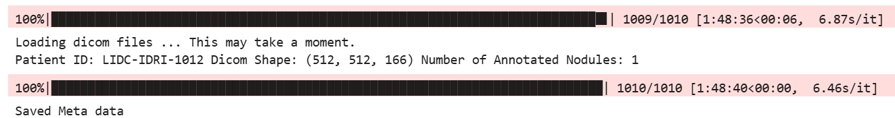

   - Conversion Completed:

     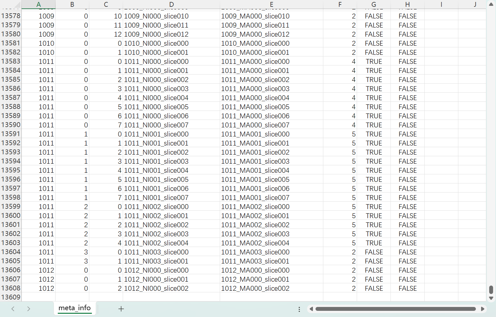

5. **Image Size Unification**

   - **Comparison of Original Images and Mask Images:**

     In the mask image, the lesion area is marked as 1. When displayed, the `imshow` function defaults to showing the region with value 1 as a bright color.

     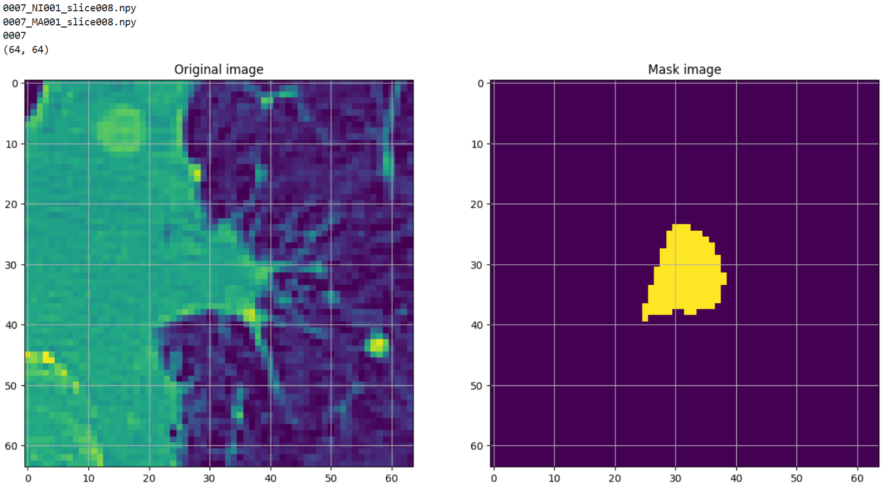

   - Checking if image size is 64x64:

     A total of **43 samples** had bounding boxes detected as **out-of-bounds** or **size anomalies**.

     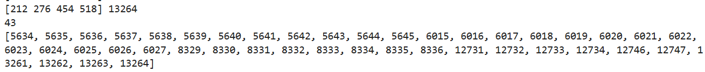

   - Path modification:

     - My Mask path has no subdirectory, so I modified the code.

       ```py
       DICOM_DIR = r"D:\aMaster\github_code\VAE_lung_lesion_BMVC\Data\Mask"
       
       all_files_list = [f for f in os.listdir(DICOM_DIR) if f.endswith('.npy')]
       all_files_list.sort()
       
       print(len(all_files_list))
       print(all_files_list[0:5])
       ```

     - I didn't check the image manually, so I don't need list2 to be labeled manually.

       ```py
       print(len(index_list))
       index_list = sorted(index_list)
       files = []
       for a in index_list:
           b = all_files_list[a]
           b = b.replace('MA', 'NI')
           files.append(b)
       print(sorted(files))
       ```

   - Deleting Anomalous Images:

     Deleted the first 13607 samples, found 43 anomalous samples, and deleted `13607 - 43 = 13564` samples.

     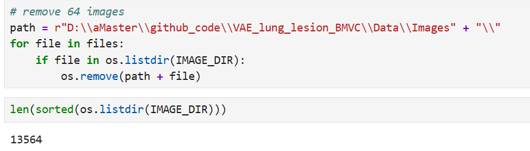

# Train Test Split

1. **Run `Train_Test_Split.ipynb`**

   - Split the patients into train/validation/test. It produces the following two files also saved here: *meta_mal_ben.csv* and *meta_mal_nonmal.csv*.
   - These files hold the meta-data for both splits of the patients: malignant vs benign (mal_ben) with ambiguous excluded and malignant vs non-malignant (mal_nonmal).

2. **`create_label_segmentation()` Function**

   - Performs **train, validation, and test splits**, assigning a `data_split` label to each patient.

   - Saves the split data as `meta.csv`.

     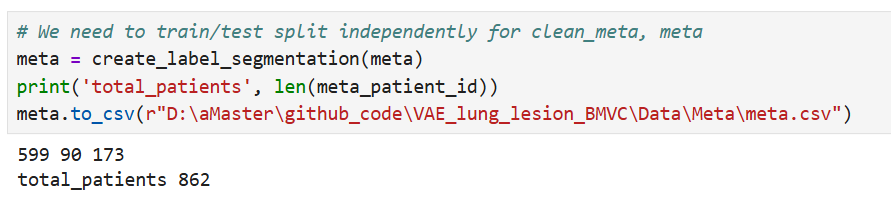

     - Extracts the unique patient ID list from the `meta` dataframe, totaling **862 patients**.
     - Test set accounts for 20%, approximately `862 × 0.2 ≈ 173` patients. Training set accounts for 80%, i.e., `862 - 173 = 689` patients.
     - Within the **training set (689 patients)**, 13% is further split as the validation set:
       - Validation set: `689 × 0.13 ≈ 90` patients.
       - Final training set: `689 - 90 = 599` patients.

3. **Saving the Split Data**

   - **`meta_mal_nonmal.csv`:**
     - Stores **malignant and non-malignant** data.
     - **Non-malignant** includes **benign and ambiguous** samples.
   - **`meta_mal_ben.csv`:**
     - Stores **malignant and benign** data.
     - **Ambiguous samples are excluded**.

4. **Saving `latent vectors`**

   - Originally included in the `LIDC_datasplit.ipynb` file, but due to redundancy, it was continued in `LIDC_DICOM_to_Numpy.ipynb`.
     - `labels.npy`: Labels for all samples, typically used for classification models.
     - `labels2.npy`: Data labels for two classes.
     - `labels3.npy`: Data labels for three classes.
     - `ambiguous.npy`: List of indices marked as ambiguous.

# VAE Model Training

1. **RandomSearch_Dirichlet_VAE.py**

   - This code is used to perform random hyperparameter search training of **the Dirichlet VAE model**.

   - **The overall structure of the `DIR_VAE` model** is defined, including the **encoder** and **decoder**. Its network structure is exactly the same as *the network structure diagram (Figure 2)* in the method section of the paper.

     > Using the Dirichlet distribution in a VAE requires a reparameterisation trick which can produce a differentiable sample from the theoretical distribution.

2. **VAE_Dirichlet_joint_loss.py**

   - This code is used to **train the Dirichlet VAE model** and introduces the **Joint Loss Function** for optimization.

3. **RandomSearchVAE.py**

   - This code is used to perform random hyperparameter search training on a standard Gaussian VAE model.

4. **VAE_joint_loss_mal_benign.py**

   - This code is used to retrain the VAE model on benign and malignant samples (Mal/Ben) and adjust the loss function structure to focus on the benign and malignant classification task.

5. **VAE_MLP_joint_loss_mal_nonmal.py**

   - This code is used to train an MLP classifier based on VAE latent space vectors to diagnosis between malignant and non-malignant (Mal/Non-Mal) samples.

### RandomSearchVAE

1. **Run `RandomSearchVAE.py`**

   - Gaussian VAE with hyperparameter training combined with MLP predictor to assess classification quality of latent vectors. Note: includes splitting slices at the patient level.
   - The main objective of the `RandomSearchVAE.py` file is:
     - **Train a Variational Autoencoder (VAE)** for **reconstruction and feature learning of lung lesion images**.
     - **Perform hyperparameter random search** to optimize critical VAE parameters (e.g., `latent_size`, `base`, `learning_rate`).
     - **Extract latent vectors**, further used for **classification tasks (MLP classifier)** to classify lesion areas as **benign/malignant**.

2. **Path Modifications**

   - Modify paths for reading images and saving models:

     ```py
     IMAGE_DIR = r"D:/aMaster/github_code/VAE_lung_lesion_BMVC/Data/Images"
     results_path = r"D:/aMaster/github_code/VAE_lung_lesion_BMVC/Data/VAE_RandomSearch"
     save_results_path = r"D:/aMaster/github_code/VAE_lung_lesion_BMVC/Data/VAE_params.pt"
     ```

   - Modify other paths:

     - Identified three volume data read paths in the code through keyword search and modified them.

       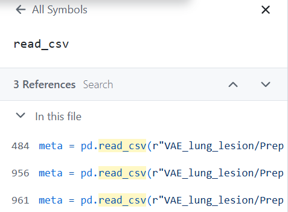

     - Also read `labels2.npy`, `labels3.npy`, `ambiguous.npy`. These files were saved in the */latent vectors* folder during preprocessing.

3. **Initialization Issues**

   - `run.npy` Initialization:

     ```py
     run_file_path = os.path.join(results_path, 'run.npy')
     if not os.path.exists(run_file_path):
         print("run.npy does not exist. Initializing...")
         np.save(run_file_path, [1])
     Run = np.load(run_file_path, allow_pickle=True)[0]
     Run += 1
     ```

   - `hyperparams_list.npy` Initialization:

     ```py
     hyperparams_file_path = os.path.join(results_path, 'hyperparams_list.npy')
     if not os.path.exists(hyperparams_file_path):
         print("hyperparams_list.npy does not exist. Initializing...")
         np.save(hyperparams_file_path, [])
     hyperparams_list = list(np.load(hyperparams_file_path, allow_pickle=True))
     print('Number tried so far:', len(hyperparams_list))
     ```

4. **Results**

   - Epoch 400:

     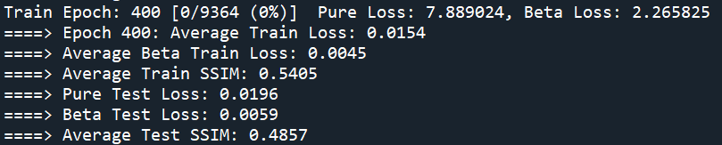

   - Epoch 50:

     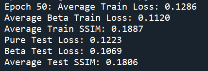

     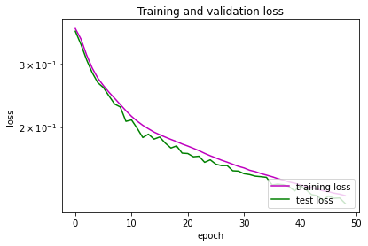

5. **Weights Only Load Failed**

   - This issue was also reported in the Github comments, but the author's link is invalid. For now, it doesn't seem to affect the model training.

     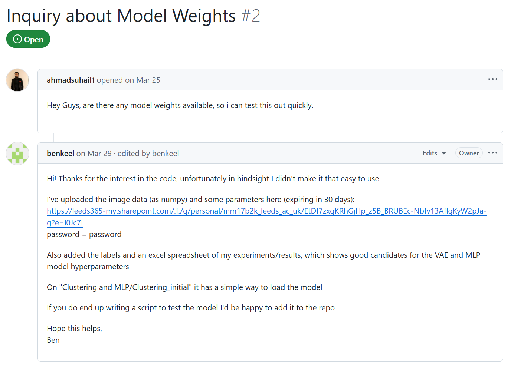

# Clustering and MLP

1. **Dirichlet_RandomSearchMLP.py**

   - This code is used to train an MLP classifier based on the Dirichlet VAE latent space vector and perform Random Search Hyperparameter Tuning.

   - This file directly corresponds to the MLP Classification on Latent Vectors section in the Experimental section.

     > The MLP classifier was trained using latent vectors extracted from the VAE models to classify lesions as malignant or non-malignant.

2. **Clustering.ipynb**

   - This code is used to **perform cluster analysis on the latent vectors** generated by **VAE** and visualize the distribution of data in the latent space.

3. **Clustering_initial.ipynb**

   - This code is the initial version of Clustering.ipynb and is used for early exploratory clustering analysis.

4. **Exploration_gaussian.ipynb**

   - This code is used to explore the latent space generated by the Gaussian VAE model, including visualization of the latent space and feature separability analysis.

5. **RandomSearchMLP.py**

   - This file is used to train an MLP classifier based on the Gaussian VAE latent space vector and perform a random search for hyperparameters (Random Search Hyperparameter Tuning).