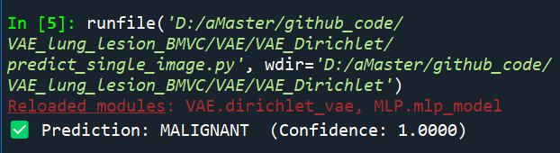

# Classification implementation

Classification in `RandomSearch_Dirichlet_VAE.py` is achieved by building an **MLP (Multi-Layer Perceptron) classifier** based on the latent vectors generated by the **VAE model**. The main steps are as follows:

1. VAE model training and generating latent vectors
2. Data preparation: generating classification datasets
3. MLP classifier architecture definition
4. Cross-validation: dataset division and training
5. Testing and evaluation

```py
/VAE/
├── dirichlet_vae.py      # VAE model class
├── trainer.py            # VAE training class
├── data_loader.py        # Data loading module
├── config.py             # Hyperparameter configuration module
├── main.py               # Main program entry

/MLP/
├── mlp_model.py          # MLP model class
├── trainer.py            # MLP training class
├── test_hyperparams.py   # Test hyperparameters
├── data_loader.py        # Data loading module
├── config.py             # Hyperparameter configuration module
├── main.py               # Main program entry

predict_single_image.py   # Make predictions for a image
```

# VAE Model

### Modify the path when running

- main.py

  ```py
  IMAGE_DIR = r"D:/aMaster/github_code/VAE_lung_lesion_BMVC/Data/Images"
  meta_file = r"D:/aMaster/github_code/VAE_lung_lesion_BMVC/Data/Meta/meta_mal_nonmal.csv"
  ```

### `main.py`

Main entry point that prepares data, initializes model and trainer, and runs training/evaluation.

**Actions**

- Loads image files from a directory (`IMAGE_DIR`)
- Reads metadata from:`meta_mal_nonmal.csv`
- Reads/Updates run index file: `run.npy`
- Saves:
  - Trained model and losses: `VAE_params.pt`
  - Latent vectors: `latent_vectors_<Run>.npy`
  - Evaluation metrics: `vae_metrics_<Run>.npy`
  - Visualization images: `visualise_*.png`
  - Loss curve: `loss_curve_<Run>.png`

**Functions Called**

- `get_random_hyperparams()` → randomly sampled hyperparameter set
- `vae_data_split(...)` → training/testing datasets
- `train_model(...)` → model training

### `data_loader.py`

**Classes**

- **`LoadImages(main_dir, files_list, HU_Upper, HU_Lower)`**
  - Loads `.npy` image files from `main_dir`, applies HU clipping, converts to tensors.
  - **Returns:** preprocessed image tensor for the given index.

**Functions**

- **`vae_data_split(IMAGE_DIR, meta_file, all_files_list, batch_size, HU_UpperBound, HU_LowerBound)`**
  - Splits dataset into training and test loaders using patient ID from metadata CSV.
  - **Returns:**`train_loader`, `test_loader` — PyTorch DataLoaders

###  `dirichlet_vae.py`

**Classes**

- **`ResampleDir(latent_dim, batch_size, alpha_fill_value)`**
  - Handles sampling and KL divergence computation using a Dirichlet prior.
  - **Functions:**
    - `sample(logits)` → Dirichlet samples
    - `prior_forward(logits)` → KL divergence loss
    - `concentrations_from_logits(logits)` → Dirichlet concentration parameters
- **`Conv(in_channels, out_channels, kernel_size, stride=1, padding=0)`**
  - Basic convolutional block with activation and normalization.
  - **Returns:** feature map tensor.
- **`ConvTranspose(...)`**
  - Transposed convolution (deconvolution) block used in decoder.
- **`ConvUpsampling(...)`**
  - Bilinear upsampling block used to reduce checkerboard artifacts.
- **`DIR_VAE(base, latent_size, alpha_fill_value)`**
  - Main VAE model with Dirichlet latent distribution.
  - **Functions:**
    - `forward(x)` → `reconstructed_x, alpha_logits, dirichlet_sample`
    - `encode(x)`, `decode(z)` → intermediate latent operations
    - `loss_function(...)` → total loss combining reconstruction, KL, and SSIM

### `trainer.py`

**Class**

- **`Trainer(params, device, Run, results_path, model)`**
  - Handles training, testing, plotting, and early stopping.

**Methods**

- **`train_model(model, lr, epochs, sample_shape, train_loader, test_loader)`**
  - Trains the model and saves final weights/losses.
  - **Saves:**
    - `VAE_params.pt` — trained weights and losses
- **`train(...)`**
  - Performs one training epoch; logs progress; visualizes images.
  - **Saves images:**
    - `visualise_real.png`
    - ``visualise_reconstructed.png`
    - `visualise_synthetic.png`
- **`test(...)`**
  - Runs evaluation on test set and returns losses and SSIM.
- **`early_stopping(counter, train_loss, test_loss, min_delta)`**
  - Implements early stopping if test loss doesn’t improve.
- **`plot_results(filename)`**
  - Plots and saves training/validation loss curves.
  - **Saves:**
    - PNG loss curve image: `filename`

### `config.py`

**Functions**

- **`get_random_hyperparams()`**
  - Randomly samples one set of hyperparameters from the predefined `PARAMETER_SPACE`.
  - **Returns:** `dict` of hyperparameters for model training.

# MLP Classifier

### Modify the path when running

- test_hyperparams.py

  ```PY
  ambiguous = np.load(r"D:/aMaster/github_code/VAE_lung_lesion_BMVC/Data/latent vectors/ambiguous.npy")
  ```

  ```PY
  if data == 1:
      # malignant vs non-malignant   
      meta = pd.read_csv(r"D:/aMaster/github_code/VAE_lung_lesion_BMVC/Data/Meta/meta_mal_nonmal.csv")
      latent_vectors = np.load(results_path + '/' + "latent_vectors_{}.npy".format(Run), allow_pickle=True)
      labels = np.load(r"D:/aMaster/github_code/VAE_lung_lesion_BMVC/Data/latent vectors/labels2.npy")
  if data == 2:
      # malignant vs benign 
      meta = pd.read_csv(r"D:/aMaster/github_code/VAE_lung_lesion_BMVC/Data/Meta/meta_mal_ben.csv")
      latent_vectors = latent_vectors2
      labels = np.load(r"D:/aMaster/github_code/VAE_lung_lesion_BMVC/Data/latent vectors/labels3.npy")   
  ```

### `main.py`

**Functions**

- **`load_info(Run, results_path)`**
  - Loads pre-trained latent vectors and VAE info from disk.
  - **Reads:**
    - `latent_vectors_<Run>.npy`
    - `vae_metrics_<Run>.npy`
  - **Returns:** latent vectors, VAE loss, metrics, latent size, base

**Actions**

- Loads run index from: `../results/run.npy`
- Calls `test_hyperparams()` to run MLP classification.
- Prints performance (AUC, accuracy, etc.) for both training objectives.
  - **Reads (indirectly):**
    - `meta_mal_nonmal.csv`, `meta_mal_ben.csv`
    - `labels2.npy`, `labels3.npy`, `ambiguous.npy`

### `test_hyperparams.py`

**Functions**

- **`test_hyperparams(params, data, nepochs, num_folds, vae_test_loss, latent_size, base, Run, results_path, latent_vectors, device)`**

  - Conducts up to 25 attempts of MLP classifier cross-validation.

  - **Reads:**

    - For `data=1`:

      `meta_mal_nonmal.csv`, `labels2.npy`, `latent_vectors_<Run>.npy`

    - For `data=2`:

      `meta_mal_ben.csv`, `labels3.npy`, `ambiguous.npy`

  - **Returns:**

    - Classification results (AUC, accuracy, loss, metrics) for both AUC-optimized and accuracy-optimized models

### `data_loader.py`

**Classes**

- **`LoadData(x, y)`**
  - PyTorch `Dataset` that wraps input features `x` and labels `y`.
  - **Returns:** one sample `(x[i], y[i])` per index.

**Functions**

- **`data_split(n, meta, latent_vectors, labels, batch_size)`**
  - Performs `n`-fold patient-level data split using `meta['patient_id']`.
  - **Returns:** `cross_val_data`, `cross_val_labels`: lists of tensors for each fold.
- **`Cross_Validation(run, n, meta, latent_vectors, labels, batch_size)`**
  - Constructs 5-fold cross-validation train/val/test loaders.
  - **Returns:** `train_loader`, `validation_loader`, `test_loader`: PyTorch DataLoaders

### `mlp_model.py`

**Classes**

- **`MLP(latent_size, base, layer_sizes, dropout, depth)`**
  - Defines a fully-connected multilayer classifier for binary prediction.
  - Uses 4- or 5-layer GELU-activated architecture with dropout and batch normalization.
  - **Returns:** forward pass output: probability between 0–1

### `trainer.py`

**Classes**

- **`Trainer(params, device, results_path, latent_size, base)`**
  - Manages MLP training, testing, evaluation, and metric logging.

**Methods**

- **`train_model(...)`**
  - Trains MLP on train set, evaluates on val/test set, applies early stopping.
  - **Saves:**
    - Model and training stats: `MLP.pt`
    - Training curve: `MLP_train_curve_run<Run>_fold<Fold>.png`
  - **Returns:** test loss, test accuracy, evaluation metrics, AUC score
- **`stats(loader, model, threshold)`**
  - Computes binary classification metrics over given loader.
- **`confusion_matrix(outputs, labels, threshold)`**
  - Builds confusion matrix for predictions vs. labels.
- **`evaluation_metrics(tp, fp, tn, fn)`**
  - Calculates precision, recall, specificity, and F1 score.
- **`average_metrics(results_list)`**
  - Averages precision, recall, specificity, and F1 across folds.
- **`plot_results(results_path, epoch, filename)`**
  - Saves training/validation loss and accuracy plots.
  - **Saves:** `MLP_train_curve_run<Run>_fold<Fold>.png`

### `config.py`

**Functions**

- **`get_random_hyperparams()`**
  - Randomly samples one set of hyperparameters from the predefined `PARAMETER_SPACE`.
  - **Returns:** `dict` of hyperparameters for model training.

# Predict Image

### `predict_single_image.py`

```py
if __name__ == "__main__":
    image_path = r"D:/aMaster/github_code/VAE_lung_lesion_BMVC/Data/Images/0001_NI000_slice000.npy"
    vae_path = "results/VAE_params.pt"
    mlp_path = "results/MLP.pt"

    prediction, prob = classify_image(image_path, vae_path, mlp_path)
    label = "MALIGNANT" if prediction == 1 else "NON-MALIGNANT"
    print(f"✅ Prediction: {label}  (Confidence: {prob:.4f})")
```

**Parameters:**

- `image_path`: path to the `.npy` image
- `vae_path`: path to VAE model checkpoint
- `mlp_path`: path to MLP model checkpoint

**Returns:**

- `pred`: binary label (1 = MALIGNANT, 0 = NON-MALIGNANT)
- `prob`: probability output from the MLP

​	